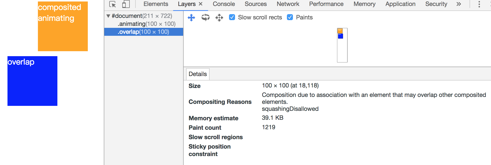
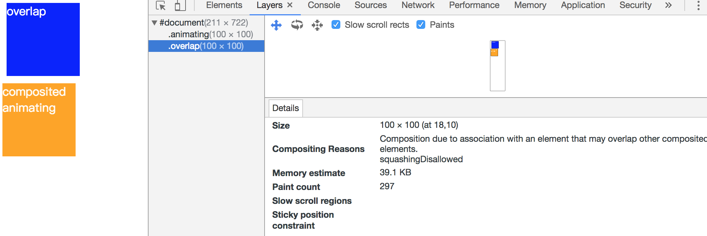
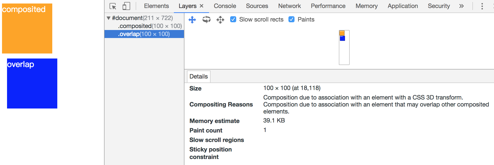
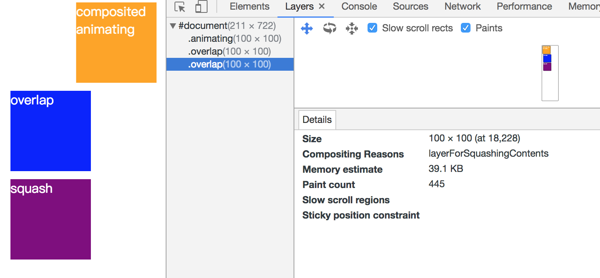
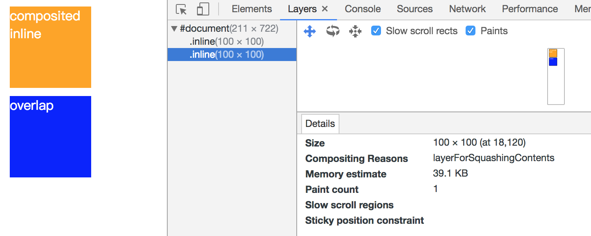
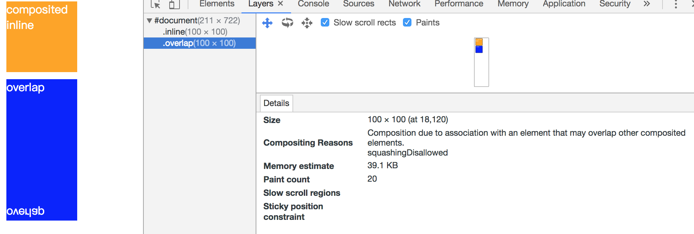

# AssumedOverlap reason
参照[`compositing相关的一些文章`](http://taobaofed.org/blog/2016/04/25/performance-composite/), 学习compositing过程中，发现AssumedOverlap原因比较抽象，同时AssumedOverlap原因一般会伴随其他原因同时出现，共同决定生成graphicsLayer，所以深入研究了下。   
compositing过程是沿着paintLayer进行深度遍历，子paintLayer根据stackingContext的顺序进行遍历, paintLayer根据compositing原因判断是否需要compositing, 需要compositing的paintLayer会生成对应的graphicsLayer。   
各个兄弟paintLayer沿着stackingContext的顺序遍历时，前面的compositing paintLayer会影响随后的paintLayer，会使随后的paintLayer产生Overlay和AssumedOverlay原因。   

## AssumedOverlap 直接原因
这里的原因并非生成graphicsLayer的原因，生成graphicsLayer的原因包含AssumedOverlap原因，这里只讨论产生AssumedOverlap原因
* kCompositingReasonVideoOverlay，父级路径上最近的能compositing的paintLayer的layoutObject为video标签
* kCompositingReasonOverflowScrollingParent，父级paintLayer为overflow，且出现滚动条
* kCompositingReason3DTransform，如transform:perspective(400px),transform: translateZ(10)，transform:scaleZ(0.5)等
* kCompositingReasonActiveAnimation, 包括opacityAnimation, transformAnimation，filterAnimation，backDropFilterAnimation
* kCompositingReasonWillChangeCompositingHint,包括opacity，transform, translate, scale, rotate, top, left, bottom, right
* kCompositingReasonBackdropFilter，即 backdrop-filter

## AssumedOverlap 产生
遍历stackingContext时，当前paintLayer的前面存在相邻的compositing paintLayer，且满足下面任一条件，则产生AssumedOverlap原因
* 前面存在相邻的compositing paintLayer有transformAnimation或者kCompositingReasonInlineTransform
* 当前paintLayer有AssumedOverlap直接原因

## 例子
* [`demo1`](https://codepen.io/yoution/pen/paOQpd)

蓝色方块由于前面的黄色方块含有transformAnimation，所以蓝色方块生成AssumedOverlap原因   

* [`demo2`](https://codepen.io/yoution/pen/paOQxa)

蓝色方块和黄色方块dom顺序调换，同时提示蓝色方块的z-index，结果同demo1，因为在stackingContext中的遍历顺序不变，所以结果一样   

* [`demo3`](https://codepen.io/yoution/pen/bLxQPr)

蓝色方块含有直接原因kCompositingReason3DTransform，所以产生AssumedOverlap原因   

* [`demo4`](https://codepen.io/yoution/pen/paOqjZ)

AssumedOverlap原因的产生的只会影响相邻的paintLayer，所以黄色方块只影响蓝色方块，而没有影响紫色方块   

* [`demo5`](https://codepen.io/yoution/pen/QQVzxJ)

对比demo1，黄色方块满足kCompositingReasonInlineTransform，但是却没有影响到蓝色生成AssumedOverlap原因，蓝色方块生成了squash原因，产生这种情况的原因是单一的AssumedOverlap原因不满足生成graphicsLayer的原因，所以导致这个原本满足AssumedOverlap原因的paintLayer被当作squash处理了

* [`demo6`](https://codepen.io/yoution/pen/qxMgOm)

对比demo5，蓝色方块本来是被作为squash原因处理了，但是蓝色方块增加了防止层压缩的属性reflect，从而显示出了AssumedOverlap原因

## 参考
* [`无线性能优化：Composite`](http://taobaofed.org/blog/2016/04/25/performance-composite/)
